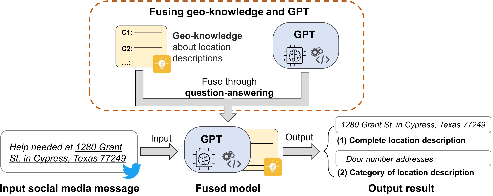
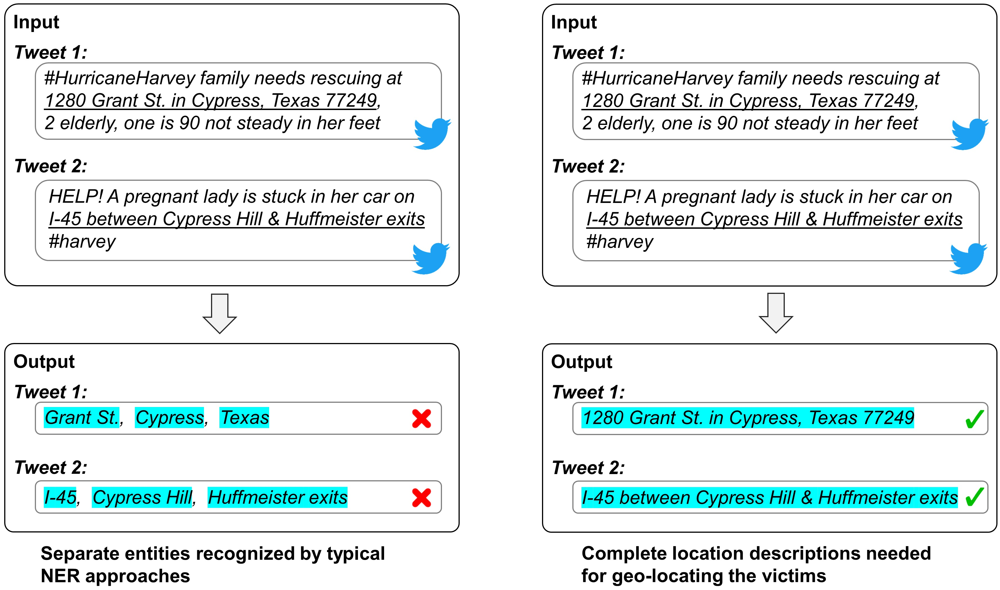

# Geo-knowledge-guided-GPT-models-for-disaster-response
Geo-knowledge-guided GPT models for disaster response

### Overall description

This repository provides code and data supporting the research paper: *Hu, Y., Mai, G., Cundy, C., Choi, K., Lao, N., Liu, W., Lakhanpal, G., Zhou, R.Z., & Joseph, K. (2023): [Geo-knowledge-guided GPT models improve the extraction of location descriptions from disaster-related social media messages](https://www.tandfonline.com/doi/full/10.1080/13658816.2023.2266495). International Journal of Geographical Information Science, 37(11), 2289-2318.*

Social media messages posted by people during natural disasters often contain important location descriptions, such as the locations of victims. Recent research has shown that many of these location descriptions go beyond simple place names, such as city names and street names, and are difficult to extract using typical named entity recognition (NER) tools. While advanced machine learning models could be trained, they require large labeled training datasets that can be time-consuming and labor-intensive to create. In this work, we propose a method that fuses geo-knowledge of location descriptions and a Generative Pre-trained Transformer (GPT) model, such as ChatGPT and GPT-4. The result is a geo-knowledge-guided GPT model that can accurately extract location descriptions from disaster-related social media messages. Also, only 22 training examples encoding geo-knowledge are used in our method. We conduct experiments to compare this method with nine alternative approaches on a dataset of tweets from Hurricane Harvey. Our method demonstrates an over 40% improvement over typically used NER approaches. The experiment results also show that geo-knowledge is indispensable for guiding the behavior of GPT models, and our method shows an over 76% improvement compared with default GPT models without being guided by geo-knowledge. The extracted location descriptions can help disaster responders reach victims more quickly and may even save lives.

 
Figure 1. An overview of the geo-knoweldge-guided GPT model.

 
 

 
Figure 2. Limitation of typical NER approaches that recognize location descriptions as separate entities rather than complete location descriptions.

### Repository organization

* "data" folder: This folder contains the 1,000 tweets from Hurricane Harvey with annotated location descriptions and their categories. The "Annotation_individual_tweets" sub folder contains the original annotations for each individual tweet. The "tweetTextAndAnnotation_combined.txt" file is a combined file that contains all tweets and their annotations. The user can choose either the individual annotated tweets or the combined file to work with based on your own preference.

* Source code files: The Jupyter Notebooks GPT-2.ipynb, GPT-3.ipynb, ChatGPT.ipynb, and GPT-4.ipynb contain code for using the Geo-GPT models and default GPT models without geo-knowledge to analyzing tweets. Note that users need to apply for your own API key from OpenAI in order to run GPT models. The Notebook EvalutionCode.ipynb contains code for generating the evaluation figures.

